# FresnelAnts

**Fresnel antenna design system for the millimeter-wave era.** Synthesize,
simulate, visualize, and manufacture Fresnel-style antennas across nine
design families — five classical (Soret / Wood zone plates, offset-fed,
phase-correcting, reflectarrays, 3D curvilinear singlets) plus four research-
grade extensions (composite multi-stage, RIS, metasurface, conformal) —
from one `pip install`.


## v0.2 highlights

| Direction | What's new |
|---|---|
| **Composite multi-stage** | `CompositeAntenna` chains plates through angular-spectrum cascades; pre-built `AchromaticDoublet`, `BifocalLens`, `FoldedReflectarray`. |
| **Reconfigurable RIS** | `ReconfigurableArray` + `CodedRIS` driven by a vendor-grounded `cells/` library (Skyworks SMV1232 varactor, MACOM PIN, Merck LC). Bias-network synthesis emitted to back-side Gerber. |
| **Sub-wavelength metasurface** | `MetasurfaceLens` (Pancharatnam–Berry) and `DualPolSharedAperture` with full Jones-matrix dual-polarization analysis, axial-ratio / cross-pol metrics. |
| **Conformal surfaces** | `CylindricalFresnelLens`, `SphericalFresnelLens`, `ConformalPOSolver` — direct PO over a triangulated mesh, no flat-FFT shortcut. |

| Composite | RIS | Metasurface | Conformal |
|---|---|---|---|
| 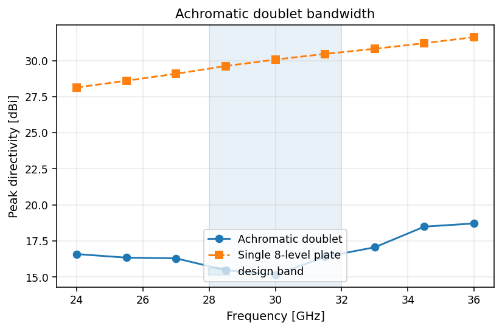 | 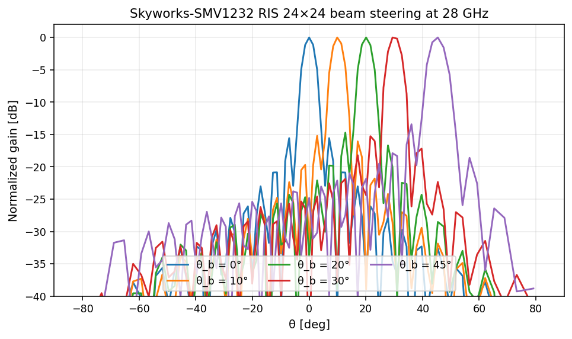 |  |  |

## v0.3 highlights

Polish + four new feature waves:

| Polish (Phase A) | New features (Phase B) |
|---|---|
| `CompositeAntenna(bounces=...)` for multi-bounce cascades | `TimeModulatedArray` + `HarmonicPOSolver` for harmonic beamforming + DOA estimation |
| Hierarchical bias-network synthesis for arrays > 64×64 | `synth/` package: scipy / CVXPY / JAX phase-synthesis backends |
| Numba JIT path for the conformal-PO solver (10–50× speedup) | `MeasuredCell` interpolates VNA / full-wave sweeps; drops into any reconfigurable design |
| Meep adapter wired end-to-end (2D-cylindrical FDTD for axisymmetric zone plates) | `Makefile`, `.pre-commit-config.yaml`, CI matrix with `[fast]`, `[fullwave]`, `[synth]`, `[measurement]` extras |

| Time-modulated harmonic beams | Phase synthesis | Measured-cell roundtrip |
|---|---|---|
| 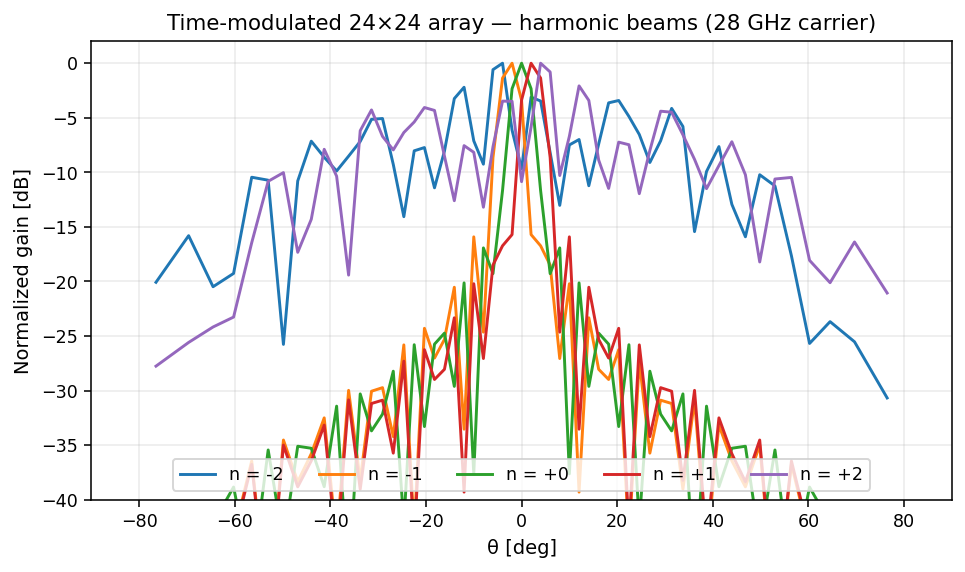 | 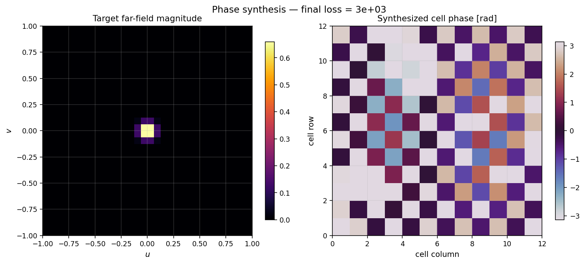 | 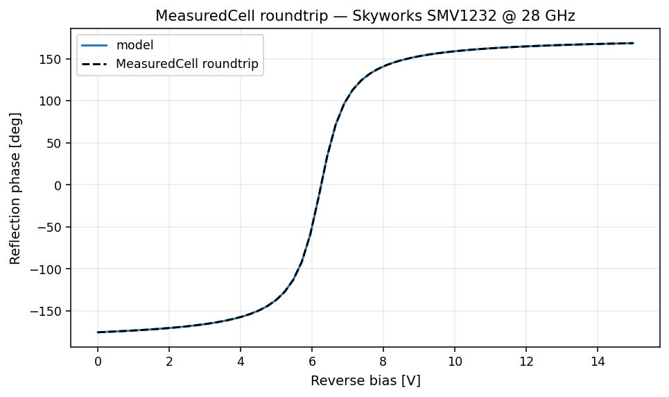 |

## Capabilities

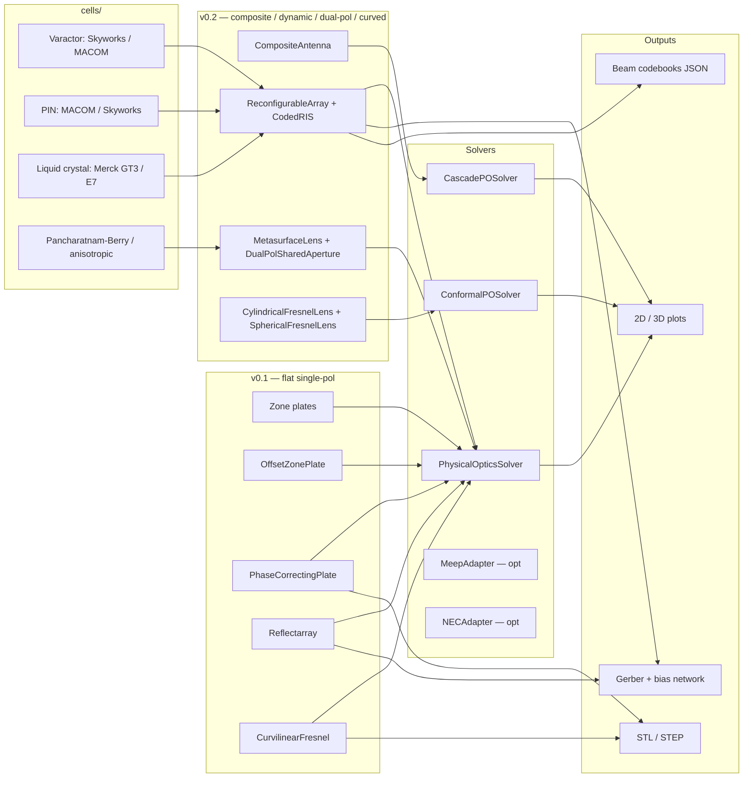

## Design pipeline

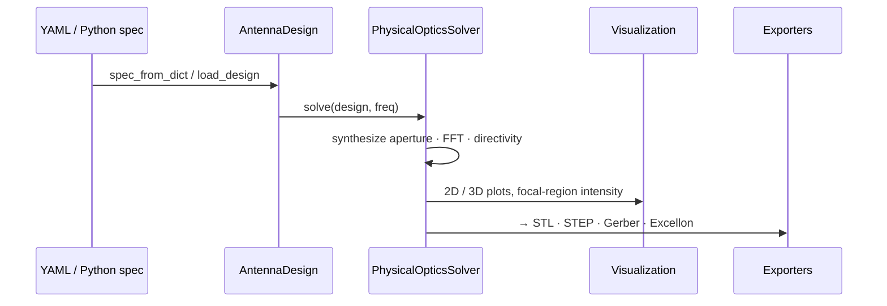

## Quickstart

```bash
python -m venv .venv && source .venv/bin/activate
pip install -e ".[dev]"           # base + dev deps
pip install -e ".[cad,fullwave]"  # optional: STEP export, Meep/NEC adapters
```

```python
import fresnelants as fa

lens = fa.PhaseCorrectingPlate(
    focal_length=0.10, design_freq=30e9,
    aperture_radius_m=0.05, levels=8,
)

solver = fa.PhysicalOpticsSolver()
result = solver.solve(lens, freq=30e9)

print(f"D = {result.far_field.peak_directivity_dbi():.1f} dBi")

from fresnelants.export.stl import export_stl
export_stl(lens, "lens.stl")          # 3D-printable

from fresnelants.viz.plots2d import plot_farfield_2d
plot_farfield_2d(result.far_field).savefig("farfield.png")
```

## Gallery

### Soret / Wood zone plate (10 GHz, 12 zones)

| Soret amplitude mask | Wood phase mask | Wood far-field | Wood E/H cuts |
|---|---|---|---|
| 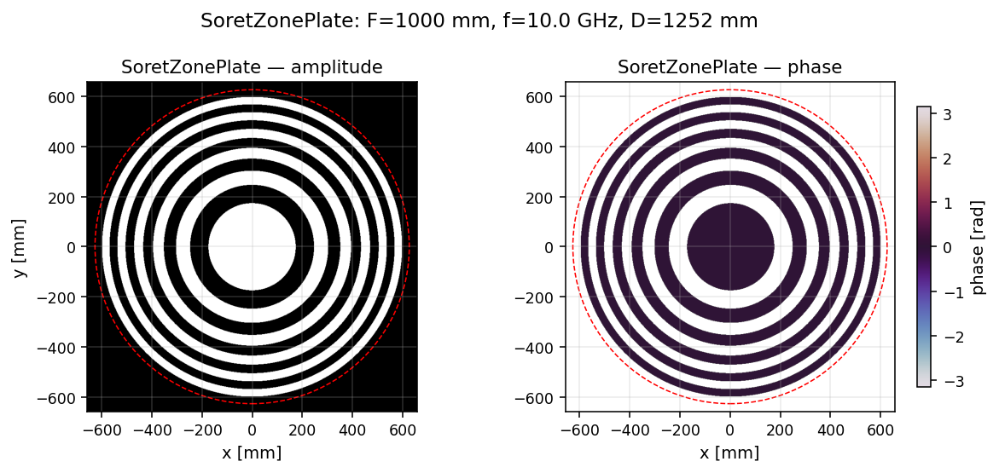 | 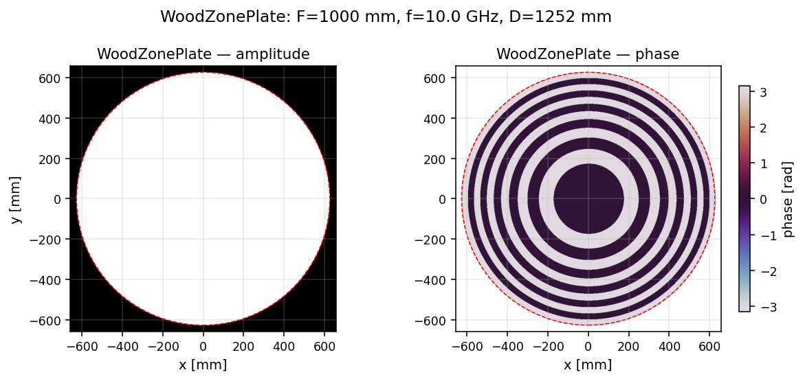 | 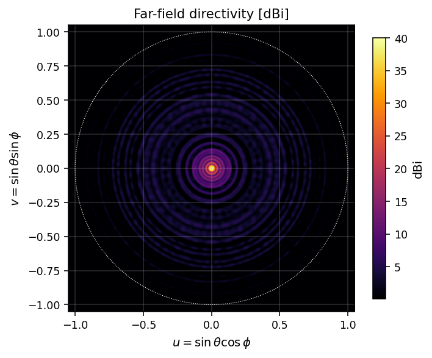 | 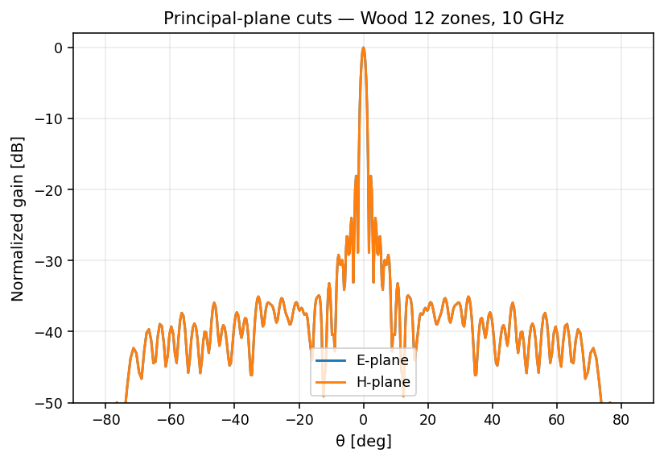 |

### Offset Fresnel (Ku-band, 25° feed offset)

| Layout | Far-field | E/H cuts |
|---|---|---|
| 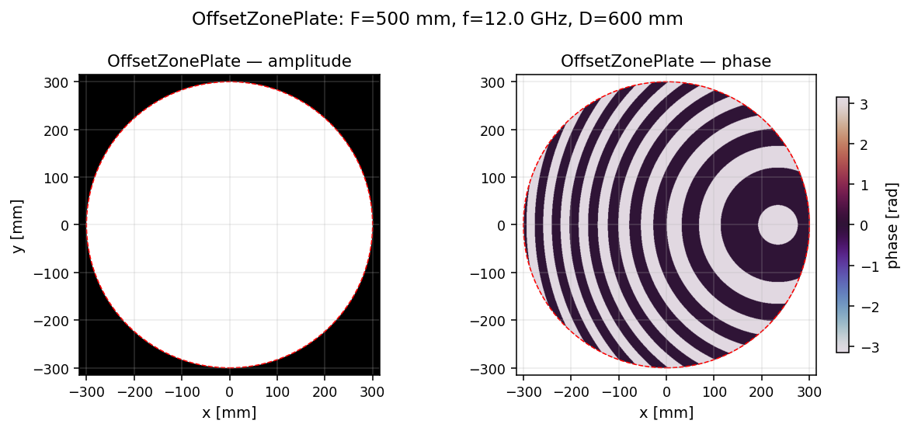 | 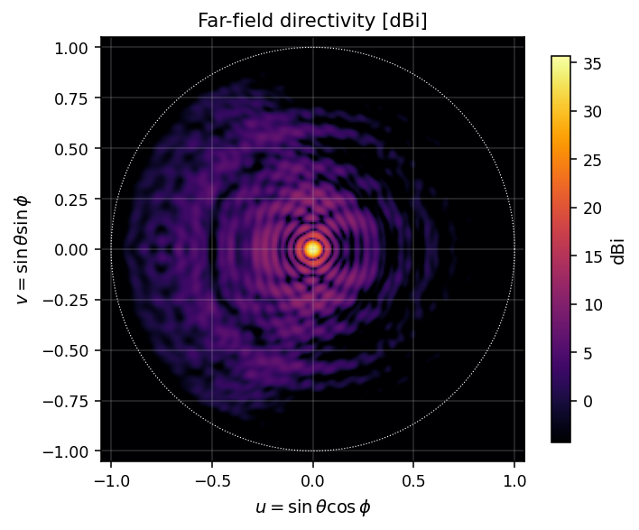 | 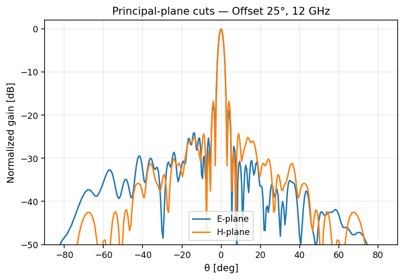 |

### Phase-correcting plate (94 GHz, 4-level)

| Layout | Far-field | Levels-vs-gain |
|---|---|---|
| 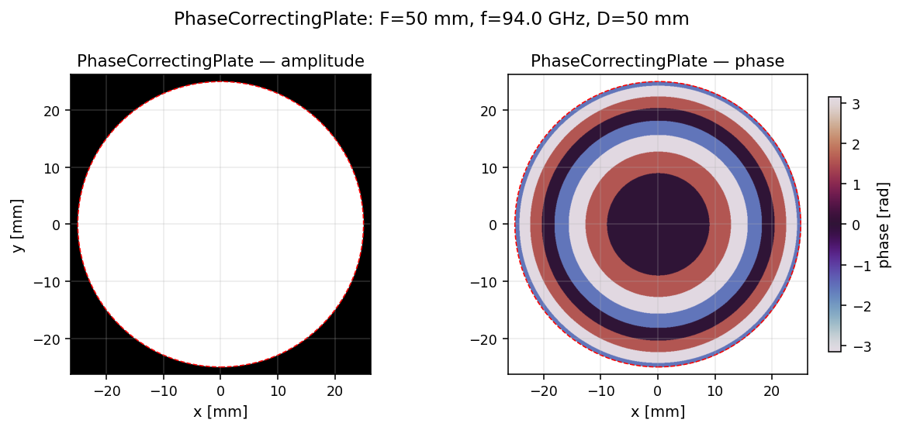 | 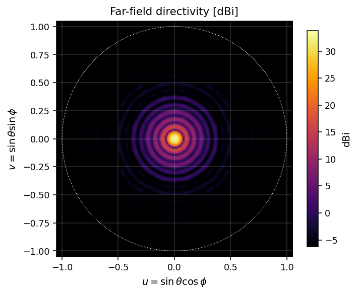 | 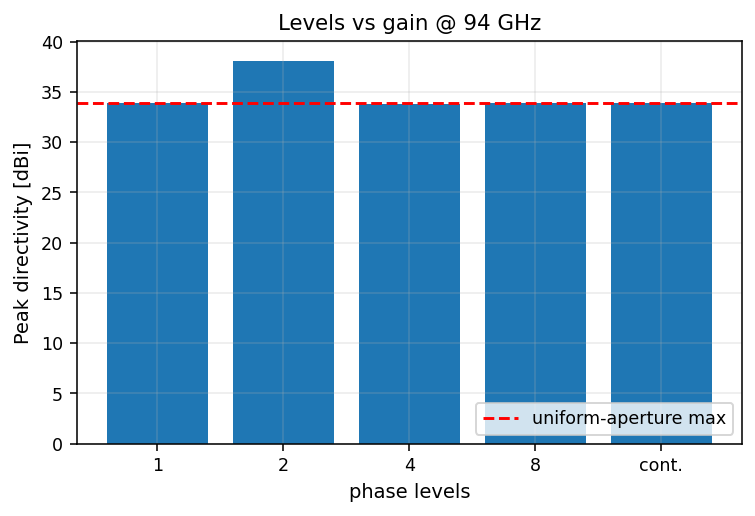 |

### Reflectarray (28 GHz, 32×32)

| Cell phase map | Far-field | Beam steering |
|---|---|---|
|  |  |  |

### Curvilinear hyperbolic lens (30 GHz)

| 3D surface | 3D pattern | Focal-region intensity |
|---|---|---|
|  |  |  |

## CLI

```bash
fresnelants design zone-plate --freq 10e9 -F 1.0 --zones 12 --kind wood --out wood.json
fresnelants design reflectarray --freq 28e9 -F 0.20 --nx 32 --ny 32 --out ra.json
fresnelants design curvilinear --freq 30e9 -F 0.10 --radius 0.05 --out lens.json

fresnelants analyze ra.json
# ┏━━━━━━━━━━━━━━━━━━━━━┳━━━━━━━━┓
# ┃ Metric              ┃  Value ┃
# ┡━━━━━━━━━━━━━━━━━━━━━╇━━━━━━━━┩
# │ Peak directivity    │  34.79 │
# │ HPBW E-plane        │   3.40 │
# │ First SLL           │ -22.30 │
# │ Aperture efficiency │  93.6% │
# └─────────────────────┴────────┘

fresnelants export stl    lens.json lens.stl
fresnelants export gerber ra.json   ./gerber/
```

## Architecture

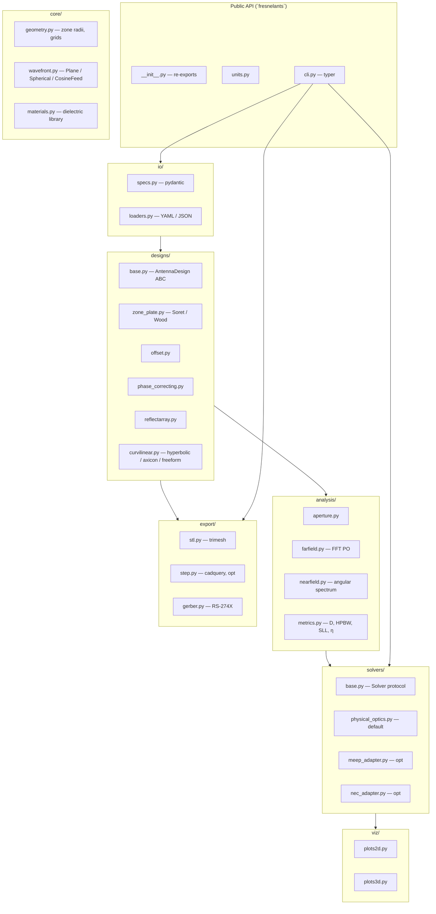

## Optional dependency matrix

| Extra | Adds | Purpose |
|---|---|---|
| (base) | numpy, scipy, matplotlib, trimesh, networkx, pydantic, typer | analysis · 2D/3D plots · STL · CLI |
| `[viz3d]` | pyvista, plotly | photorealistic 3D renders, interactive HTML |
| `[cad]` | cadquery, gerber-writer | STEP export · richer Gerber tooling |
| `[fullwave]` | PyNEC2 | MoM solver adapter |
| `[docs]` | mkdocs-material, mkdocs-mermaid2-plugin, mkdocstrings | build the docs site |
| `[dev]` | pytest, hypothesis, ruff, mypy | run the test suite |

## Repository layout

```
src/fresnelants/      # package source
tests/                # pytest suite (analytical identities + STL/Gerber checks)
examples/             # five end-to-end runnable examples (one per family)
docs/                 # MkDocs site, theory, per-design pages
docs/img/             # auto-generated figures (committed; CI gates drift)
docs/generate_figures.py  # single source of truth for every figure in docs/img
```

## Development

```bash
pip install -e ".[dev]"
pytest                                # 31 tests, ~7 s
ruff check . && ruff format --check .
mypy src
python docs/generate_figures.py       # regenerate the gallery
mkdocs serve                          # docs site at http://127.0.0.1:8000
```

CI (`.github/workflows/ci.yml`) runs the full lint + type + test sweep on
each push and re-renders `docs/img/`; if any committed PNG differs the build
fails, so docs cannot drift from the implementation.

## License

MIT — see `LICENSE`.

## References

* Hristov, *Fresnel Zones in Wireless Links, Zone Plate Lenses and Antennas*
  (Artech House, 2000).
* Wiltse, "The Fresnel Zone-Plate Lens", *Proc. SPIE* 544 (1985).
* Huang & Encinar, *Reflectarray Antennas* (Wiley/IEEE, 2008).
* Balanis, *Antenna Theory: Analysis and Design*, 4th ed. (Wiley, 2016) — ch. 12.
