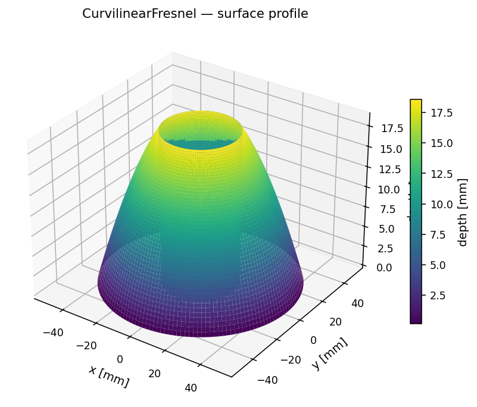
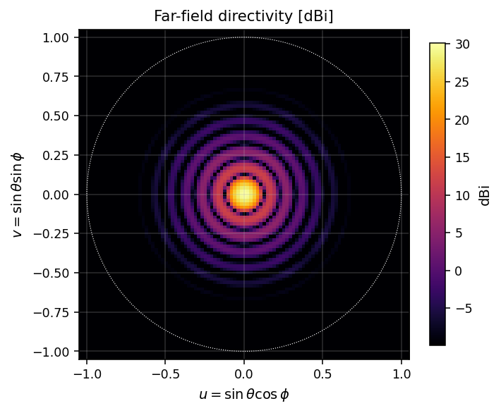
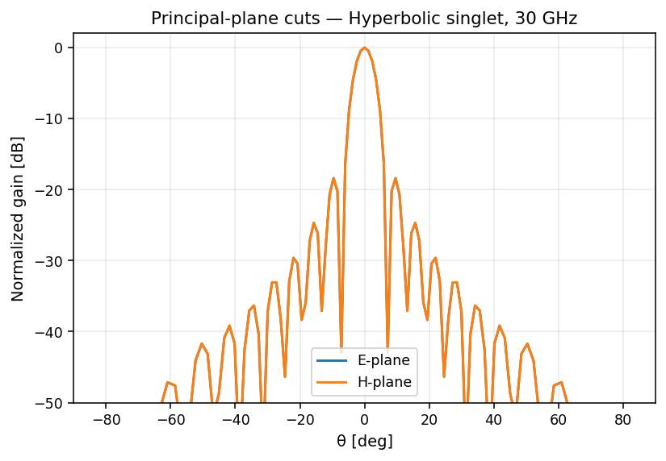
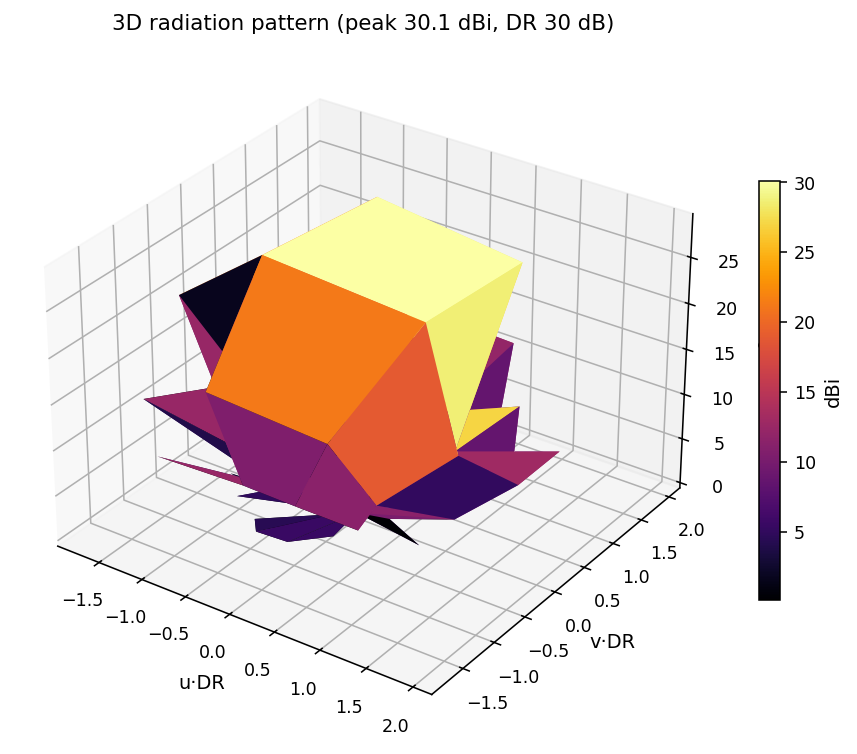
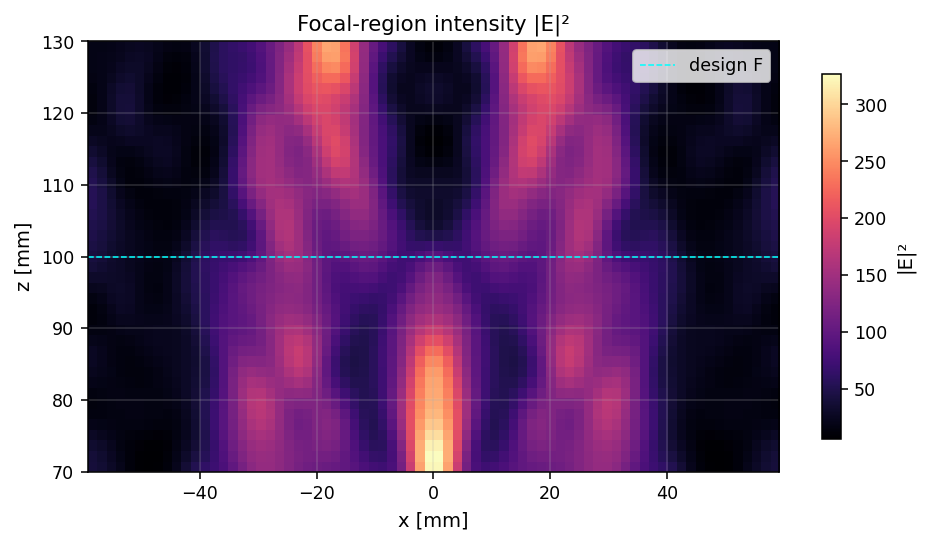
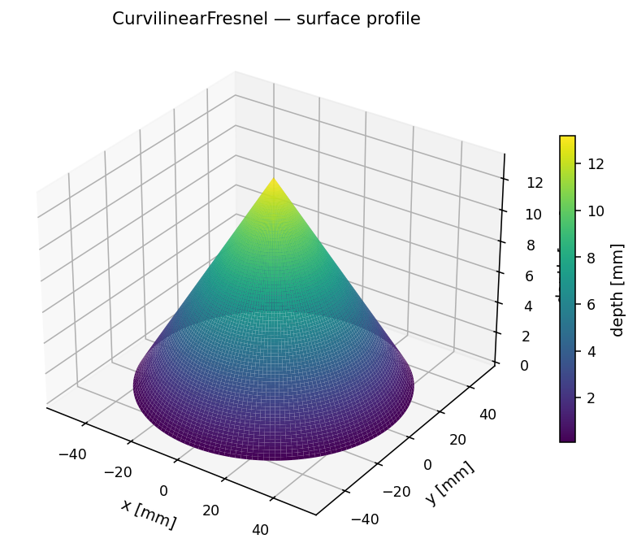

# Curvilinear / 3D Fresnel surfaces

Continuous parametric surfaces whose dielectric thickness profile follows a
prescribed law and is then folded modulo λ/(n−1) into Fresnel zones. Three
profiles ship with the library:

* **Hyperbolic singlet** — Fermat's principle solution turning a spherical
  feed into a planar wavefront.
* **Axicon** — conical-ring surface producing a Bessel-like focal *line*
  rather than a focal point.
* **Freeform** — user-supplied callable f(R) → depth.

## Hyperbolic singlet (30 GHz, F/D = 1)

| Surface profile | Far-field | E/H cuts |
|---|---|---|
|  |  |  |

3D radiation pattern and focal-region intensity:

| 3D pattern | Focal region |
|---|---|
|  |  |

## Axicon variant



## API

```python
import math
import fresnelants as fa

# Hyperbolic singlet
lens = fa.CurvilinearFresnel(
    focal_length=0.10,
    design_freq=30e9,
    aperture_radius_m=0.05,
    profile="hyperbolic",
    dielectric=fa.materials.HDPE,
)

# Axicon (Bessel-beam)
axicon = fa.CurvilinearFresnel(
    focal_length=0.10,
    design_freq=30e9,
    aperture_radius_m=0.05,
    profile="axicon",
    axicon_angle=math.radians(8),
)

# Freeform — pass any callable depth(R)
def parabolic(R):
    return 0.005 * (1 - (R / 0.05)**2)
freeform = fa.CurvilinearFresnel(
    focal_length=0.10,
    design_freq=30e9,
    aperture_radius_m=0.05,
    profile="freeform",
    freeform=parabolic,
)
```

## CLI

```bash
fresnelants design curvilinear --freq 30e9 -F 0.10 --radius 0.05 \
    --profile hyperbolic --out lens.json
fresnelants export stl lens.json lens.stl
```
