# Fractal Fresnel zone plates

Six designs built from two fractal generators applied to the Fresnel zone
construction:

* **Cantor** zone plates (radial, triadic): `FractalSoretZonePlate` (binary
  amplitude), `FractalWoodZonePlate` (per-zone phase reversal — the
  "Devil's lens" variant).
* **Sierpinski carpet** (Cartesian): `SierpinskiCarpetZonePlate` (square
  aperture mask), `SierpinskiReflectarray` (fractal-tiled microstrip array).
* **3D conformal** Cantor: `SphericalFractalFresnelLens` (spherical cap),
  `ConicalFractalFresnelLens` (cone — axicon-style).

The defining physical signature of the Cantor zone plate is **multiple
on-axis foci** at z = F, F/3, F/5, … This polyfocal trace is unique among
the families in FresnelAnts and is the load-bearing physical regression
test for the family (see `tests/test_designs.py::test_fractal_cantor_polyfocal_signature`).

## Layouts

| Cantor Soret (binary) | Cantor Wood (Devil's lens) |
|---|---|
| 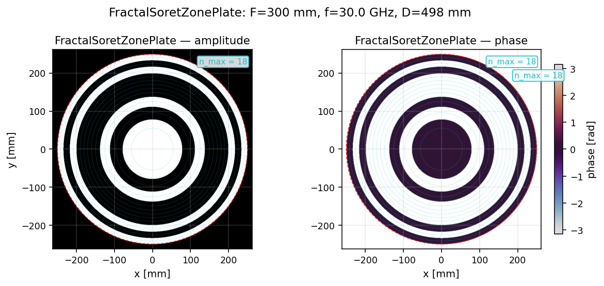 | 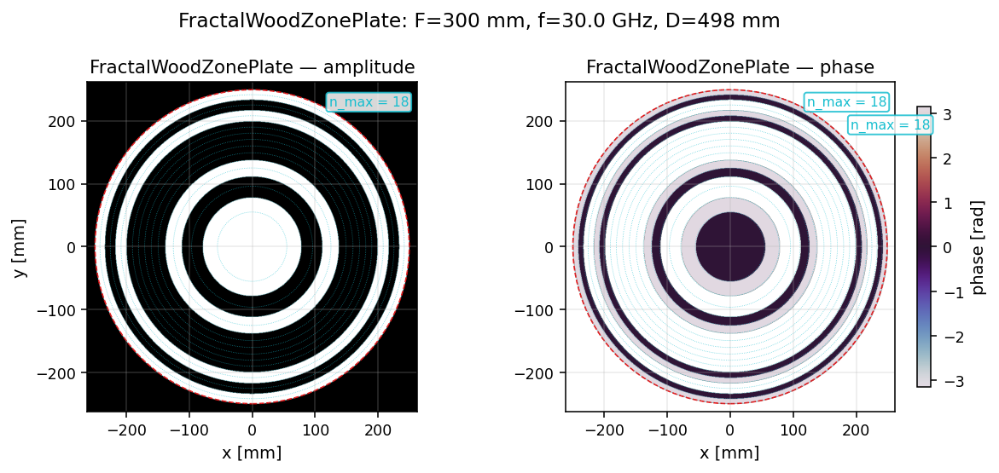 |

| Sierpinski carpet | Sierpinski reflectarray |
|---|---|
| 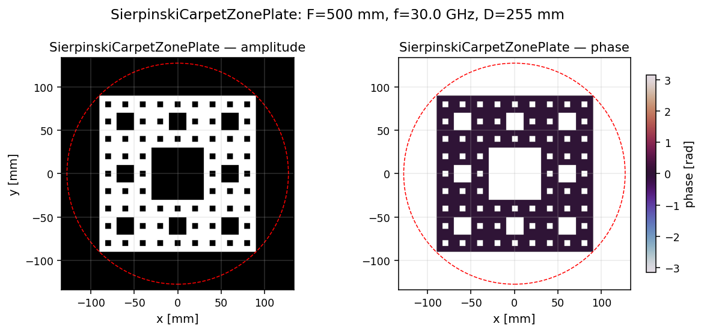 | 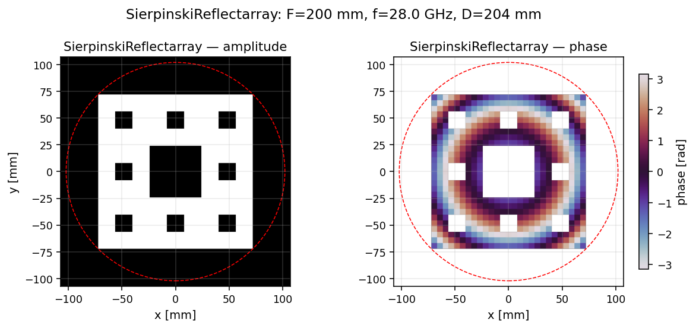 |

## Polyfocal signature

The Cantor zone plate's diffraction pattern carries multiple equally
spaced foci along the optical axis at the odd subharmonics of F. A
classical Wood zone plate (overlay) produces a single primary focus at F:

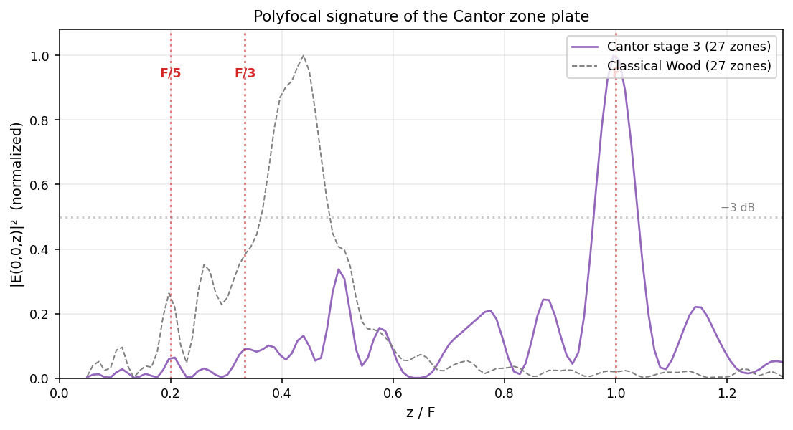

## Far-field

Cantor Wood @ 30 GHz, F = 0.30 m, stage 2, base unit 2:

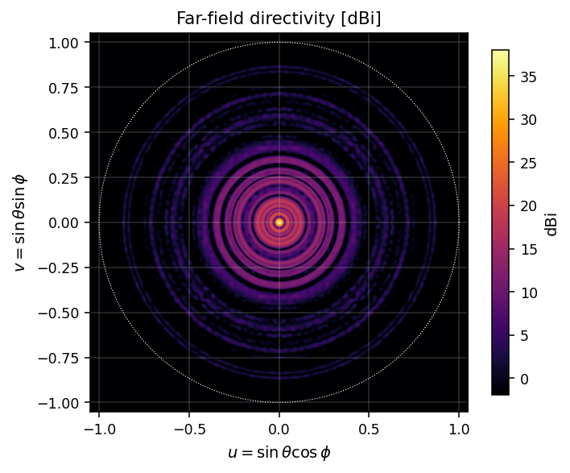
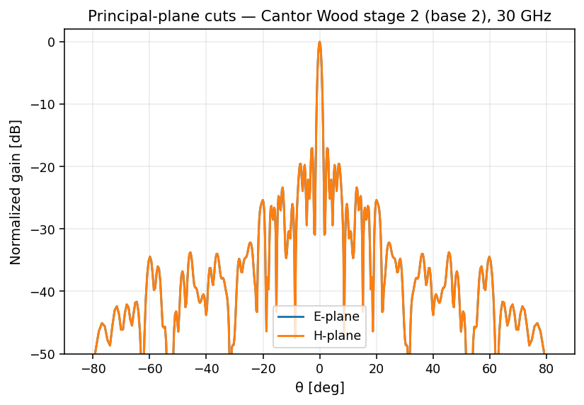

Sierpinski carpet @ 30 GHz (4-fold-symmetric self-similar lobes):

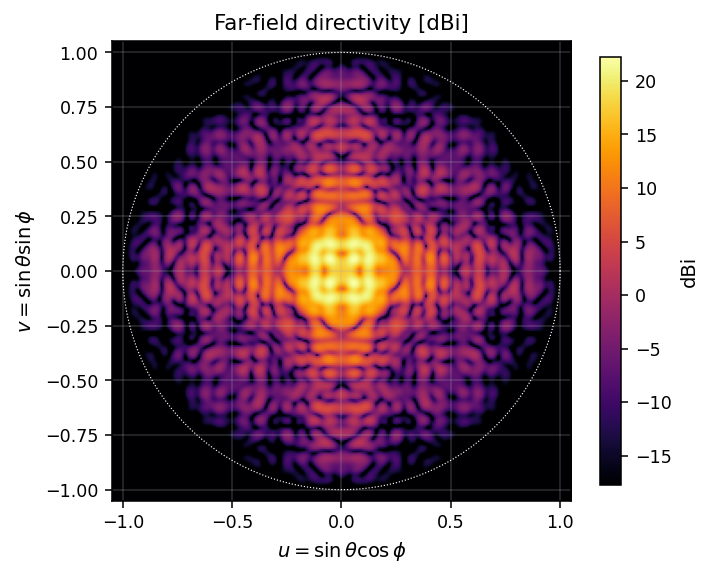

Sierpinski reflectarray @ 28 GHz:

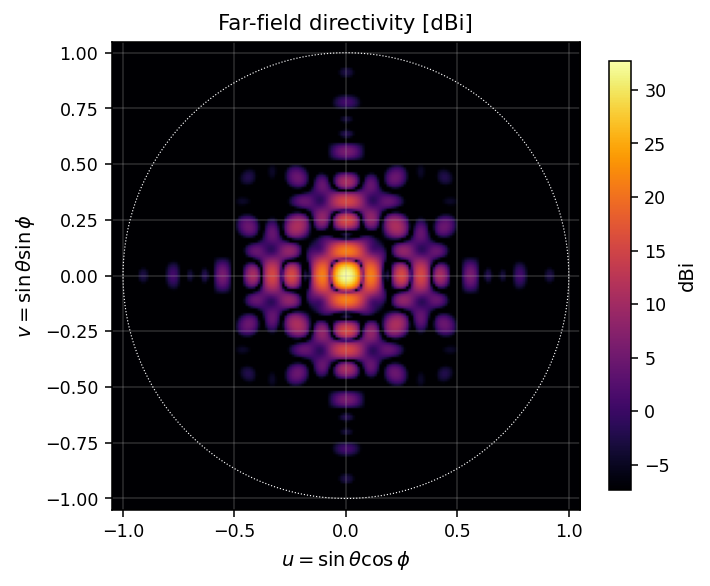

## 3D conformal variants

Spherical fractal lens @ 77 GHz (5 cm hemisphere, stage 2 Cantor in
projected radius):

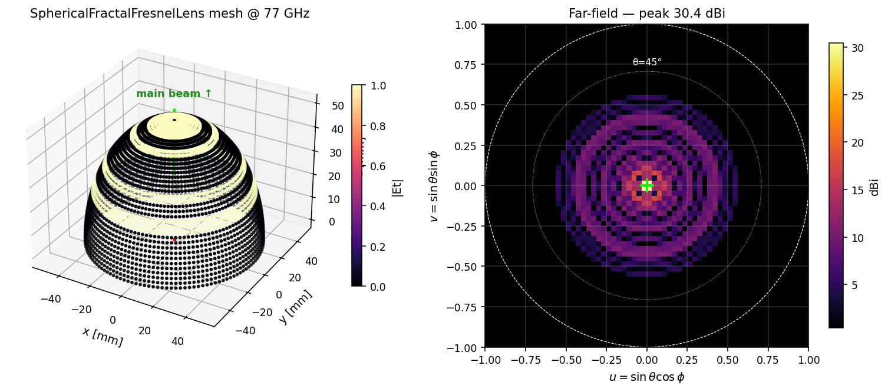

Conical fractal lens @ 77 GHz (45° half-angle, 5 cm height, stage 2). The
cone substrate naturally produces an **axicon-style ring beam** rather
than a single broadside peak — interesting for non-diffracting Bessel-beam
applications:

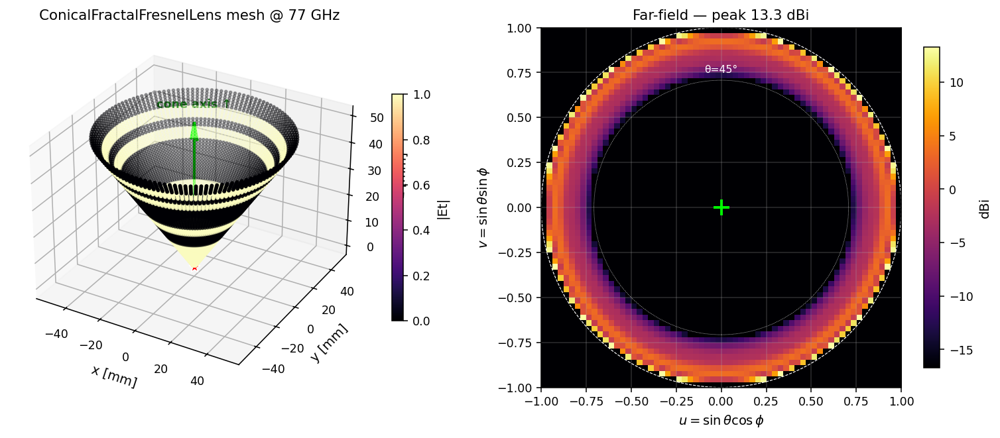

## Theory

### Why the squared-radius coordinate works

The classical Fresnel zone radii satisfy `r_n² = n·λ·F + (n·λ/2)² ≈ n·λ·F`,
so they're **equispaced in the squared-radius coordinate** ζ = r²/(λF).
Subdividing ζ via the triadic Cantor middle-thirds rule therefore lands
cleanly on integer Fresnel-zone indices, preserving the alternating
odd/even phase structure that makes Wood-style phase reversal meaningful.
Any other coordinate transformation would smear the construction across
fractional Fresnel zones and destroy the polyfocal property.

### Cantor construction

The triadic Cantor middle-thirds rule applied to the integer Fresnel-zone
index range `[0, base_unit · 3^S)`:

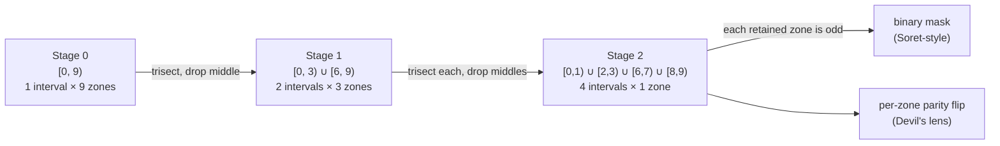

After **S** Cantor iterations:

* Total Fresnel zones = `base_unit · 3^S`.
* Retained Cantor intervals = `2^S`, each of width `base_unit` zones.

### Stage evolution and polyfocal foci

Higher Cantor stages add finer sub-focal structure to the on-axis
intensity. Both panels at all three stages are computed from the same
`F = 0.30 m`, 30 GHz Cantor binary mask:

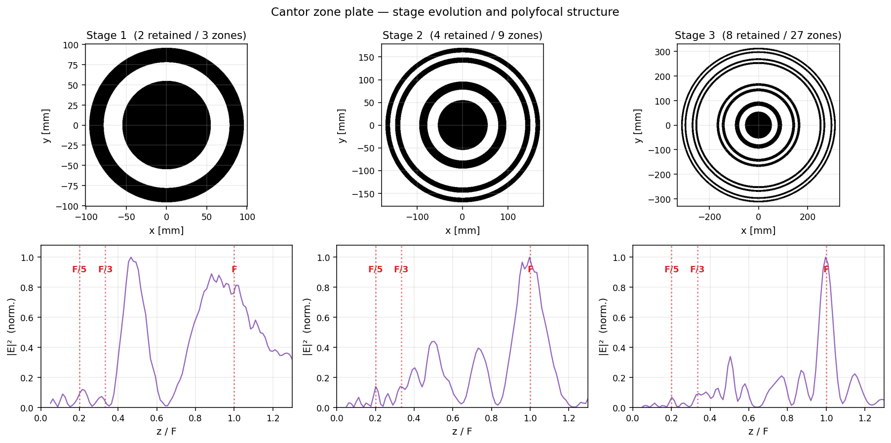

### Wood ≡ Soret at base_unit = 1

At `base_unit = 1` (the canonical Cantor zone plate of Saavedra/Furlan/
Monsoriu), every retained Fresnel zone happens to be **odd** — so the
Wood phase-reversal multiplier (×−1 on even zones) makes no difference,
and `FractalWoodZonePlate` degenerates to `FractalSoretZonePlate`. At
`base_unit ≥ 2` each retained interval contains both odd and even zones,
restoring the classical 6 dB Wood-vs-Soret efficiency boost:

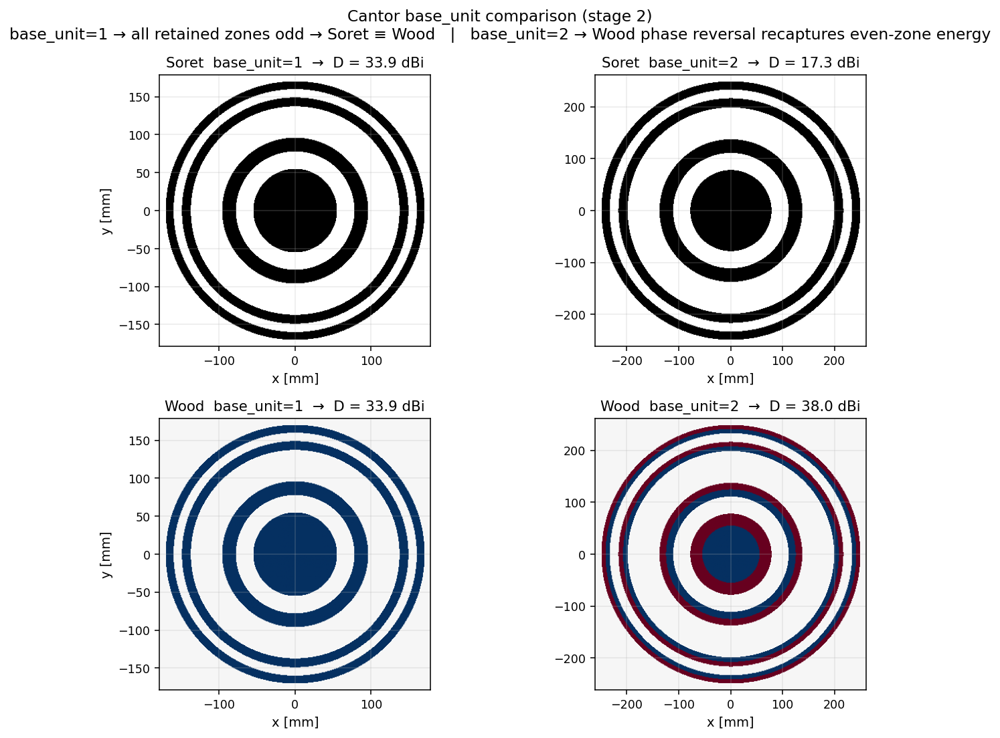

### Axicon ring beam (conical lens)

A cone surface with a `−k·z` focusing phase doesn't focus to a point —
the surface normal tilts at the cone half-angle, so each surface point
radiates predominantly in a tilted direction. The coherent sum produces
a **Bessel-beam-like ring** at θ ≈ half_angle. This is the physical
reason `tests/test_conformal.py::test_conical_fractal_lens_emits` checks
only directivity, not the +z hemisphere (the broadside +z direction is
typically a far-field *minimum* for a cone aperture).

## API

```python
import fresnelants as fa

# Canonical (literature) Cantor zone plate, polyfocal.
cantor = fa.FractalSoretZonePlate(focal_length=0.3, design_freq=30e9, stage=3)

# Devil's lens variant with non-trivial phase reversal.
devil = fa.FractalWoodZonePlate(focal_length=1.0, design_freq=10e9, stage=2, base_unit=2)

# Cartesian fractal mask.
carpet = fa.SierpinskiCarpetZonePlate(
    focal_length=0.5, design_freq=30e9, stage=3, aperture_side=0.18,
)

# Fractal-tiled reflectarray (composes Reflectarray with a Sierpinski mask).
sra = fa.SierpinskiReflectarray(
    focal_length=0.20, design_freq=28e9, nx=27, ny=27, fractal_stage=2,
)

# 3D conformal variants — use ConformalPOSolver, not PhysicalOpticsSolver.
sph = fa.SphericalFractalFresnelLens(
    radius=0.05, cap_angle_deg=90.0, design_freq=77e9, stage=2,
)
cone = fa.ConicalFractalFresnelLens(
    half_angle_deg=45.0, height=0.05, design_freq=77e9, stage=2,
)
solver = fa.ConformalPOSolver(n_samples=64)
res = solver.solve(sph, 77e9)
```

## CLI

```bash
# 2D Cantor / Sierpinski variants
fresnelants design fractal --freq 10e9 --focal-length 1.0 --stage 3 --kind wood --out cantor.json
fresnelants design fractal --freq 30e9 --focal-length 0.5 --kind sierpinski --aperture-side 0.18 --out carpet.json
fresnelants design fractal --freq 28e9 --focal-length 0.2 --kind sierpinski_reflectarray --nx 27 --ny 27 --stage 2 --out sra.json

# 3D conformal variants
fresnelants design fractal-3d --substrate spherical --freq 77e9 --radius 0.05 --stage 2 --out sphfractal.json
fresnelants design fractal-3d --substrate conical   --freq 77e9 --half-angle-deg 45 --height 0.05 --stage 2 --out conefractal.json

fresnelants analyze cantor.json
```

## References

* Saavedra, Furlan & Monsoriu, "Fractal zone plates", *Opt. Lett.* **28**, 971 (2003).
* Monsoriu, Saavedra & Furlan, "Fractal Devil's lenses", *J. Opt. Soc. Am. A* **24**, 3500 (2007).
