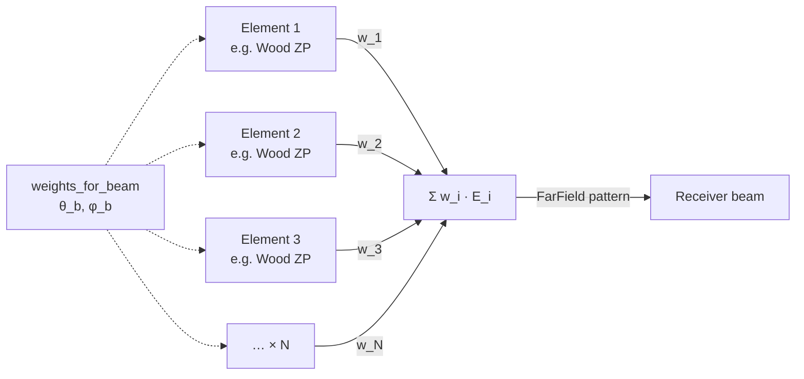
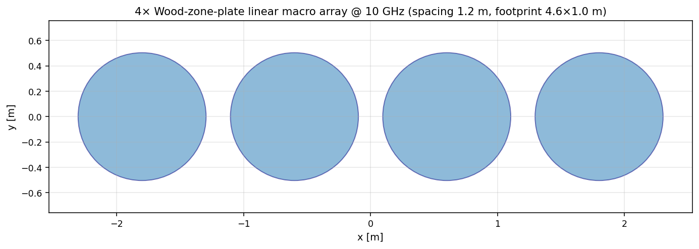
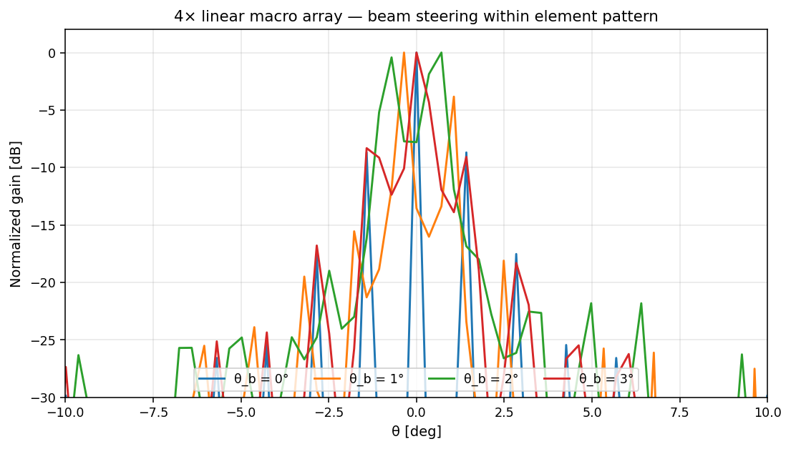
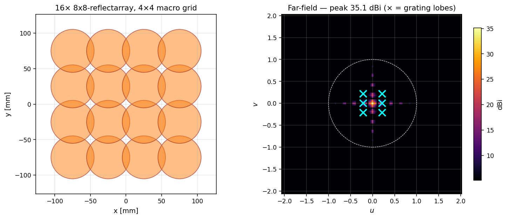
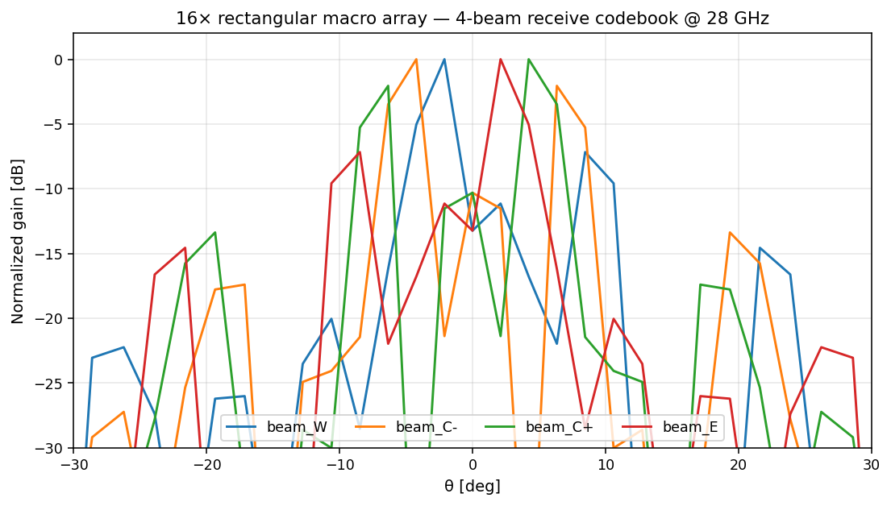
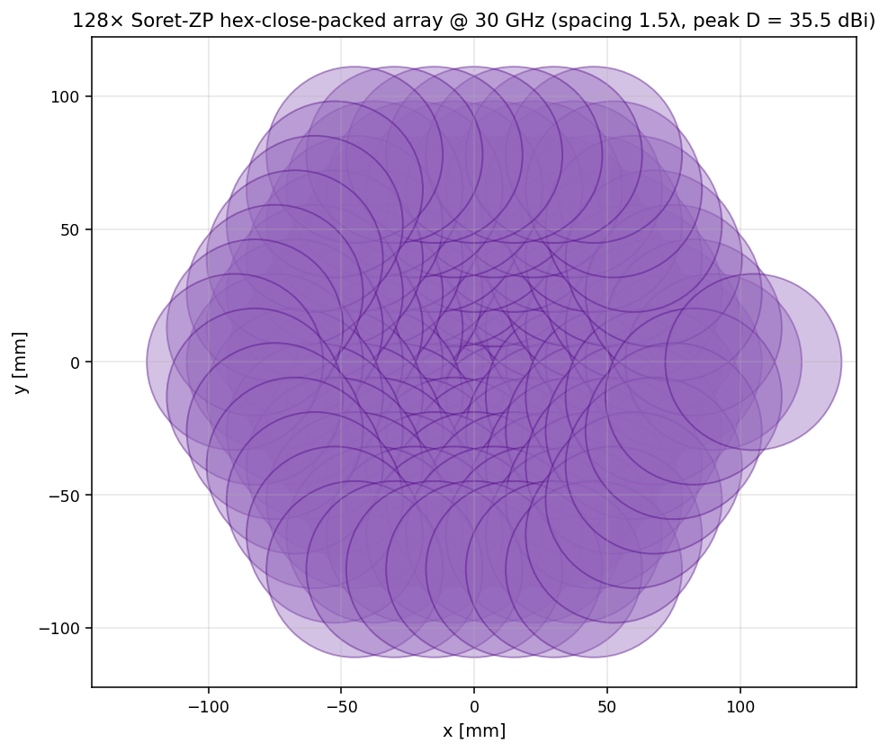
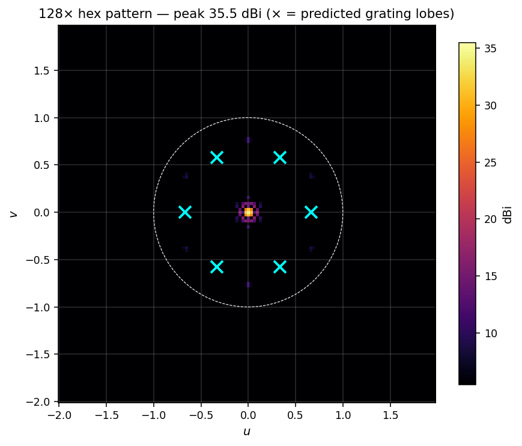
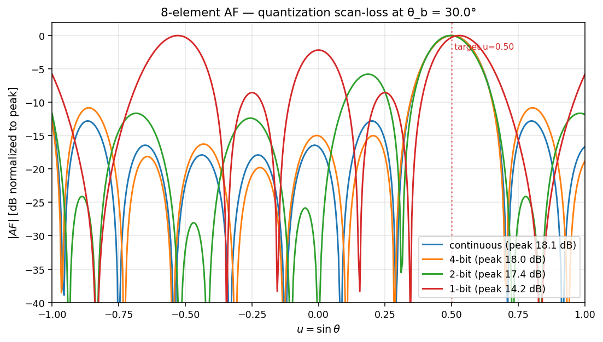
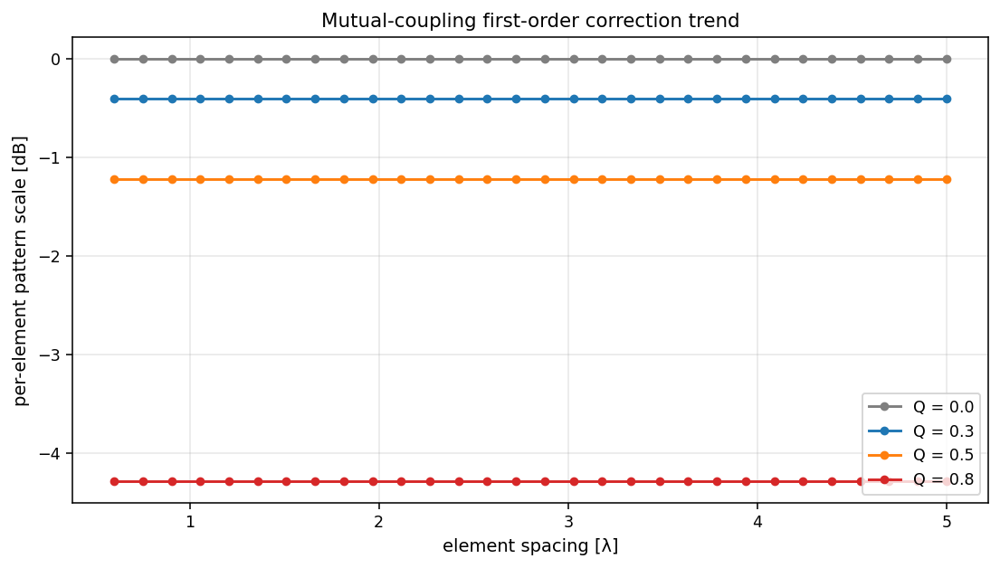

# Macro arrays of Fresnel-antenna elements

A `MacroFresnelArray` is the architectural level **above** the per-cell
phased arrays already in the package (`Reflectarray`, `ReconfigurableArray`,
…). Each element is itself a complete Fresnel antenna — zone plate,
reflectarray, conformal lens, fractal, anything subclassing `AntennaDesign`
— and the array combines N of them with complex per-element weights to
form one or more receive beams. Element spacings are typically multi-
wavelength (because each element is an aperture many λ across), so
**grating lobes in visible space are an explicit design feature**, not a
defect — this is the architecture used in radio-astronomy aperture arrays
(SKA-style) and millimetre-wave Cassegrain-element arrays.

## Architecture



The radiation pattern is computed via the textbook **array-factor times
element-pattern** decomposition (Mailloux ch. 1):

```
E_total(θ, φ) = E_element(θ, φ) · AF(θ, φ; w_i, positions)
AF(θ, φ; w_i, positions) = Σ_{i=0}^{N-1} w_i · exp[+j · k · (u·x_i + v·y_i)]
```

This formulation is **O(N) per (u, v) sample** and trivially scales to
N=128+ without rebuilding the element pattern. The element pattern is
computed once via the existing `PhysicalOpticsSolver`; the array factor
is multiplied analytically.

## Lattice geometries

| `linear` | `rect` | `hex` | `ring` |
|---|---|---|---|
| 1×N row | M×N grid | hex-close-packed | N elements on a circle |

```python
from fresnelants.core.geometry import element_lattice_positions

positions = element_lattice_positions(n_elements=128, spacing_m=0.015, lattice="hex")
# (128, 2) array of (x, y) [m]
```

## Layouts and patterns

### 4-element linear array (Wood ZP, 10 GHz)




### 16-element 4×4 rectangular array (8×8 reflectarray, 28 GHz)

The cyan ×'s mark the predicted grating-lobe positions for d = 0.05 m at
28 GHz. The 4-beam codebook overlay shows the receive multi-beam
capability:




### 128-element hex-close-packed array (Soret ZP, 30 GHz)




## Steering and weights

For a target direction (θ_b, φ_b), the **conjugate-matched receive weight**
on the i-th element is

```
w_i = exp(-j · k · (u_b·x_i + v_b·y_i))   where u_b = sin θ_b cos φ_b, v_b = sin θ_b sin φ_b
```

```python
arr = fa.MacroFresnelArray.from_lattice(
    fa.WoodZonePlate(focal_length=1.0, design_freq=10e9, num_zones=8),
    n_elements=4, spacing_m=1.2, lattice="linear",
)
w = arr.weights_for_beam(theta_deg=2.0, phi_deg=0.0)
result = arr.solve(solver, freq=10e9, weights=w)  # MacroArrayResult
print(result.far_field.peak_directivity_dbi())
```

**Element-pattern bound on scan range.** Because the total pattern is
``element × AF``, the array can only steer within the element's main
lobe. For high-gain Fresnel-antenna elements (HPBW < 5°), the array
becomes a **fine-pointing** array: it can re-aim within ~1° around the
element's mechanical pointing direction, but not arbitrarily across the
hemisphere. This is a real engineering constraint of phased aperture
arrays and the reason the gallery shows steering at small θ_b for the
4-element example.

## Multi-beam receive codebooks

```python
book = arr.beam_codebook(
    directions=[(-15.0, 0.0), (-5.0, 0.0), (5.0, 0.0), (15.0, 0.0)],
    labels=["beam_W", "beam_C-", "beam_C+", "beam_E"],
)
# {label: (N,) complex weight vector}
```

Each label maps to a complex weight vector that, when applied via
`arr.solve(solver, freq, weights=book[label])`, produces a beam pointing
at that direction. Codebooks let a receive array form many simultaneous
output streams from the same N RF inputs.

## Quantized weights (analog/RFIC receivers)

Real RF beamformers can only apply a finite number of phase shifts
(1-bit / 2-bit / 4-bit / 6-bit). Pass `bits=N` to quantize to ``2^N``
phase steps:

```python
w_4bit = arr.weights_for_beam(theta_deg=30.0, phi_deg=0.0, bits=4)
```

The textbook 1-bit scan-loss bound is ~3.9 dB worst case; the gallery
quantization figure shows the 1/2/4-bit/continuous comparison:



## Mutual-coupling first-order correction

For tightly-spaced elements (d_min < 5λ), the package supports a
heuristic per-element pattern scaling

```
scale = sqrt(1 − Q² · exp(−2 · d_min/λ))
```

where ``d_min`` is the minimum element-edge separation and ``Q`` is the
user-supplied `coupling_q` parameter (default 0 = correction disabled).
This is a **trend model** (Carver & Mink 1981, Mailloux ch. 8) — useful
for quick design exploration, not a substitute for full-wave coupling.

```python
arr = fa.MacroFresnelArray.from_lattice(
    elem, n_elements=4, spacing_m=2.5*wavelength, coupling_q=0.5,
)
# arr._coupling_scale(freq) returns the scaling factor
```



## Theory

The array factor identity follows from the linearity of the wave equation
and the assumption of identical elements. For weighted superposition

```
E_total(r̂) = Σ_i w_i · E_i^{element}(r̂) · exp(+j · k · r̂·r_i)
            = E_element(r̂) · Σ_i w_i · exp(+j · k · (u·x_i + v·y_i))
            = E_element(r̂) · AF(r̂)
```

valid when (a) all elements have the same E_element pattern (identical
elements + the same orientation), (b) mutual coupling between elements
is negligible (sparse aperture-array regime, d_min ≥ a few λ), and (c)
the array is in the radiating far-field of each element.

**Grating-lobe positions.** For a linear array of period d steered to u_b,
grating lobes appear at `u_g = u_b ± m·λ/d` for integer m. For
two-dimensional lattices the grating-lobe condition is
`u_g = u_b ± m_1·λ/d_1 ± m_2·λ/d_2` for the two lattice vectors.
Hexagonal lattices have grating lobes on the dual hexagonal lattice.

**Array gain identity.** For uniform weights and an element pattern that
is approximately constant over the AF main lobe and grating lobes,
``D_array = D_element + 10·log10(N)``. For high-gain (narrow) element
patterns the realised enhancement is a few dB below this bound because
the element pattern attenuates grating-lobe contributions to the radiated
power (which would otherwise lower the directivity).

## API

```python
import fresnelants as fa
import numpy as np

# Build a 16-element 4×4 array of small reflectarray elements at 28 GHz.
elem = fa.Reflectarray(focal_length=0.20, design_freq=28e9, nx=8, ny=8)
arr = fa.MacroFresnelArray.from_lattice(
    elem, n_elements=16, spacing_m=0.05, lattice="rect", rows=4,
    coupling_q=0.0,  # opt-in mutual coupling correction
)

# Solve for uniform weights.
solver = fa.PhysicalOpticsSolver(samples_per_wavelength=4.0, pad_factor=4)
result = arr.solve(solver, 28e9)
print(result.far_field.peak_directivity_dbi())
print(result.weights.shape)            # (16,) complex
print(result.array_factor_grid.shape)  # (ny, nx) on element u/v grid

# Solve with a steered weight vector and 4-bit quantization.
w = arr.weights_for_beam(theta_deg=10.0, phi_deg=0.0, bits=4)
result_steered = arr.solve(solver, 28e9, weights=w)
```

## CLI

```bash
# Build a 4-element linear array of Wood zone plates at 10 GHz.
fresnelants design macro-array --freq 10e9 \
    --element-spec examples/specs/wood_zone_plate_10ghz.yaml \
    --lattice linear --n-elements 4 --spacing 1.5 \
    --beam-theta-deg 0 --out my_array.json

# Analyze.
fresnelants analyze my_array.json

# 128-element hex with 4-bit weights and a corner beam.
fresnelants design macro-array --freq 30e9 \
    --element-spec /tmp/soret_2zone.yaml \
    --lattice hex --n-elements 128 --spacing 1.5 \
    --bits 4 --beam-theta-deg 5 --beam-phi-deg 30 \
    --out hex128.json
```

## References

* Mailloux, *Phased Array Antenna Handbook*, 3rd ed. (Artech House, 2018).
* Hansen, *Phased Array Antennas*, 2nd ed. (Wiley, 2009).
* Carver, K. R. & Mink, J. W. "Microstrip antenna technology", *IEEE Trans.
  Antennas Propag.* 29 (1981) — coupling-correction heuristic.
