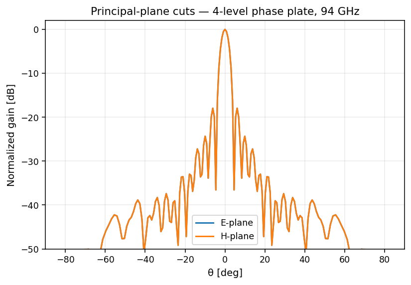

# Phase-correcting Fresnel plate

An N-level dielectric phase plate quantizes the ideal continuous phase
profile in 2π/N steps. As N increases, primary-focus efficiency climbs
toward the uniform-aperture limit:

| N | Theoretical efficiency |
|---|---|
| 1 (Soret) | ~10 % |
| 2 (Wood) | ~40 % |
| 4 (quarter-wave) | ~81 % |
| 8 | ~95 % |
| ∞ (continuous) | ~100 % |

## Layout & far-field (4-level, 94 GHz, 25 mm aperture)

| Layout | Far-field | E/H cuts |
|---|---|---|
|  |  |  |


## API

```python
import fresnelants as fa

plate = fa.PhaseCorrectingPlate(
    focal_length=0.05,
    design_freq=94e9,
    aperture_radius_m=0.025,
    levels=4,             # 1=Soret, 2=Wood, 4=quarter-wave, 1024=continuous
    dielectric=fa.materials.HDPE,
)
```

## CLI

```bash
fresnelants design phase-correcting --freq 94e9 -F 0.05 --radius 0.025 --levels 4 --out plate.json
fresnelants export stl plate.json plate.stl
```

## Manufacturing

Use [`export_stl`](../manufacturing.md) to get a watertight 3D-printable
mesh; with the `[cad]` extra installed, [`export_step`](../manufacturing.md)
produces a parametric STEP solid that imports into FreeCAD / Fusion / Rhino.
