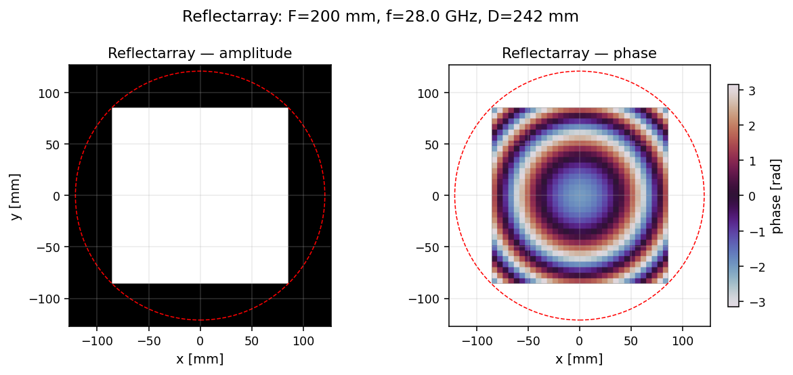
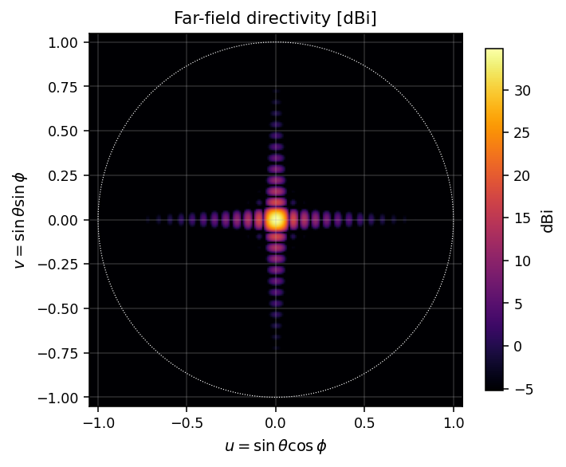
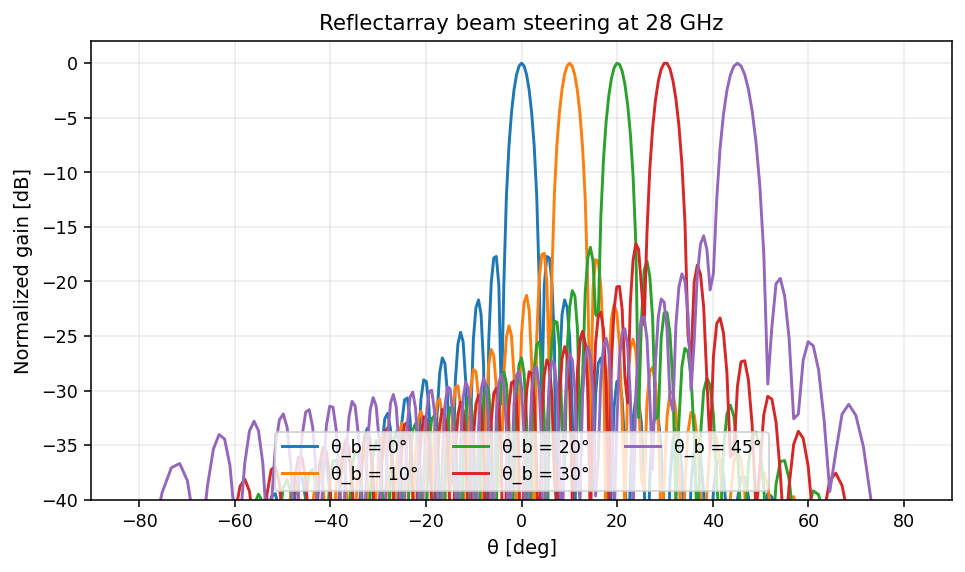
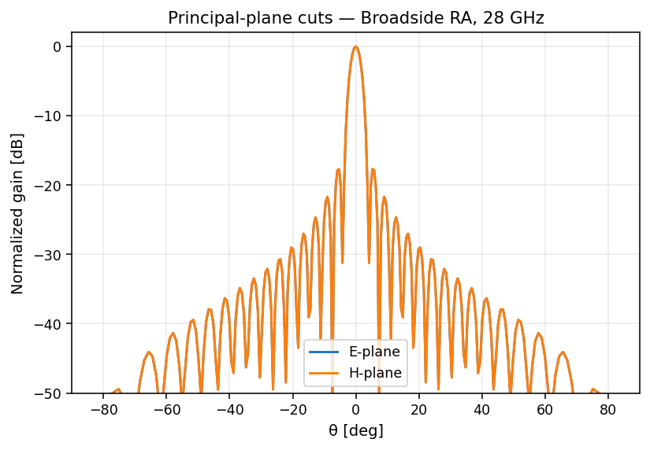

# Reflectarray

A planar array of unit cells whose reflection phases are tuned to mimic the
behavior of a parabolic reflector, with the added freedom to electronically
steer the main beam by reprogramming each cell's phase.

| Cell phase map | Far-field | Beam steering sweep |
|---|---|---|
|  |  |  |

E / H cuts at broadside:



## API

```python
import math
import fresnelants as fa

ra = fa.Reflectarray(
    focal_length=0.20,
    design_freq=28e9,
    nx=32,
    ny=32,
    cell_size=0.0,                          # 0 → 0.5 λ
    feed_offset=(0.0, 0.0),
    beam_direction=(math.radians(20), 0),   # steer to θ = 20°, φ = 0
    feed_q=6.0,                             # cosine-q feed exponent
    phase_levels=None,                      # None = continuous; 4 = 2-bit array
)
```

## CLI

```bash
fresnelants design reflectarray --freq 28e9 -F 0.20 --nx 32 --ny 32 \
    --beam-theta-deg 20 --out ra.json
fresnelants analyze ra.json
fresnelants export gerber ra.json ./gerber/
```

## Manufacturing

The Gerber exporter produces RS-274X copper, soldermask, and an Excellon
drill placeholder. The patch-size ↔ phase mapping is currently a generic
square-patch lookup; for production designs replace it with values fit to
your unit cell from full-wave simulation.
