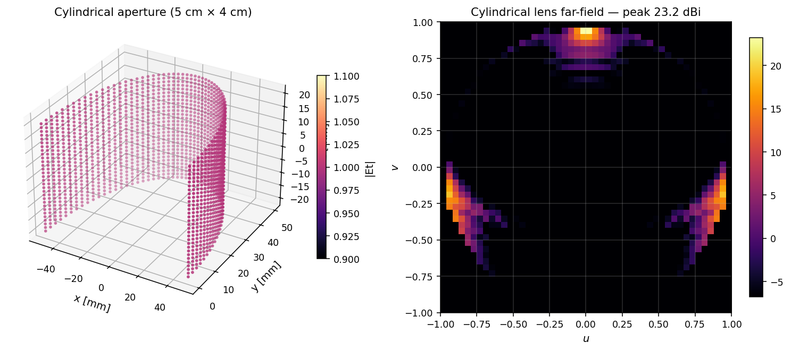

# Conformal / curved-surface designs

Direct PO summation over a triangulated mesh — no flat-FFT shortcut. Drops
the flat-aperture assumption so antennas can wrap on cylinders, spheres,
or arbitrary freeform substrates (vehicle bumpers, satellite dishes, drone
hulls).

```mermaid
graph LR
  Mesh[ConformalAperture] --> Field[Et per facet]
  Field --> Sum[Direct PO sum]
  Sum --> FF[Far-field on (u, v) grid]
```

## Cylindrical Fresnel @ 77 GHz (automotive radar)



A 5 cm radius × 4 cm height cylindrical aperture, with cell phase set so the
front half radiates a broadside (u ≈ 0) plane wave — the canonical
bumper-wrapped automotive-radar configuration.

```python
import fresnelants as fa

lens = fa.CylindricalFresnelLens(
    radius=0.05, height=0.04, design_freq=77e9, nu=80, nv=40
)
solver = fa.ConformalPOSolver(n_samples=128)
result = solver.solve(lens, freq=77e9)
```

## Spherical Fresnel cap

```python
sphere = fa.SphericalFresnelLens(
    radius=0.05, cap_angle_deg=60, design_freq=28e9, nu=80, nv=40
)
```

## Mesh constructors

| Constructor | Geometry |
|---|---|
| `ConformalAperture.from_cylinder(radius, height, nu, nv)` | Right-circular cylinder section |
| `ConformalAperture.from_sphere(radius, cap_angle, nu, nv)` | Spherical cap |
| `ConformalAperture(points, normals, areas, Et, freq)` | Freeform mesh |

## Cost

Direct integration scales as O(N_facets · N_directions). The default
128 × 128 direction grid + 4096-facet chunks runs in < 1 s for a few-thousand-
facet mesh. For very large meshes (> 50k facets) consider Numba JIT or
chunked GPU acceleration (planned in v0.3).
