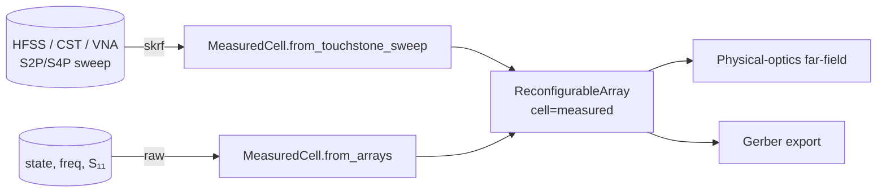

# Hardware in the loop — measured cells

`MeasuredCell` is a `TunableCell` whose phase / loss come from a tabulated
`(state, freq) → S₁₁` mapping — typically the output of an HFSS / CST /
openEMS sweep, or a VNA measurement of a physical fabricated cell.



## Roundtrip vs. analytical model


A `Skyworks_SMV1232` varactor sampled on a 64-state grid at 28 GHz, then
reconstructed via `MeasuredCell` interpolation. Phase matches to within 0.5°.

## API

```python
import numpy as np
import fresnelants as fa
from fresnelants.cells.measured import MeasuredCell

# Path 1 — raw arrays (e.g. from a Python full-wave sweep).
states = np.linspace(0, 15, 32)
freqs = np.linspace(26e9, 30e9, 9)
s11 = ...  # shape (32, 9), complex
cell = MeasuredCell.from_arrays(states, freqs, s11)

# Path 2 — Touchstone sweep (.s2p per state). Requires `[measurement]`.
cell = MeasuredCell.from_touchstone_sweep(
    {0.0: "0V.s2p", 5.0: "5V.s2p", 10.0: "10V.s2p", 15.0: "15V.s2p"},
    port=0,
)

# Persist to JSON for embedded controllers.
cell.save("smv1232_28ghz.json")
cell2 = MeasuredCell.load("smv1232_28ghz.json")

# Drop into any reconfigurable design.
ris = fa.ReconfigurableArray(focal_length=0.20, design_freq=28e9, nx=24, ny=24, cell=cell)
```

## Why this matters

The default Gerber exporter uses a generic patch-size↔phase lookup that's
useful for prototyping but won't match a real fabricated unit cell. Replace
the cell model with a `MeasuredCell` calibrated against your specific
substrate / element geometry, and the synthesized board layout matches
silicon.
