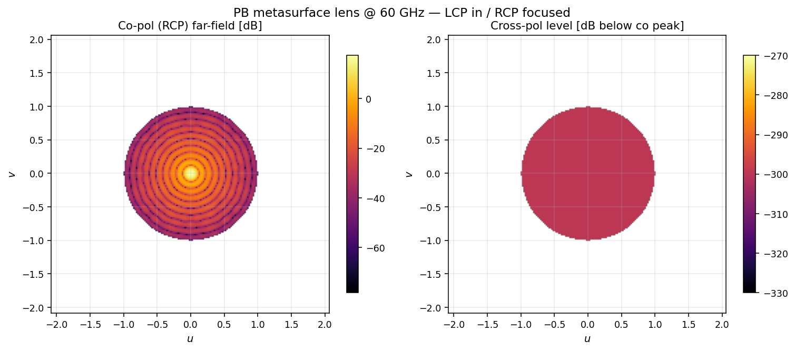

# Sub-wavelength metasurfaces

Dual-polarization Pancharatnam–Berry and anisotropic-cell designs.

## Pancharatnam–Berry lens

A PB cell at rotation α acts as a half-wave plate at α; under circular
polarization it maps LCP → RCP (or RCP → LCP) and imparts a geometric phase
of ±2α. The lens uses the rotation map α(r) so that 2α(r) cancels the
spherical-feed propagation phase, focusing the cross-polarization output.



Co-polarization (RCP) shows the focused beam; cross-pol level (Ex / Ey) is
suppressed across the visible region.

```python
import fresnelants as fa
from fresnelants.analysis.farfield import far_field_from_jones_aperture
from fresnelants.analysis.dualpol_metrics import polarization_purity

lens = fa.MetasurfaceLens(focal_length=0.05, design_freq=60e9, aperture_radius_m=0.025)
ap = lens.jones_aperture_field(60e9)
ff = far_field_from_jones_aperture(ap)
purity = polarization_purity(ff, "rcp")
```

## Dual-pol shared aperture

`DualPolSharedAperture` interleaves two metasurfaces — one per polarization,
each tuned to a different frequency — into a single physical aperture.
Useful for V/H or low/high-band shared apertures (28 / 39 GHz, etc.).

```python
sa = fa.DualPolSharedAperture(f_v=28e9, f_h=39e9, focal_v=0.10, focal_h=0.10, aperture_radius_m=0.05)
ap_v = sa.jones_aperture_field(28e9)  # V-pol active
ap_h = sa.jones_aperture_field(39e9)  # H-pol active
```

## Cell library

| Class | Phase mechanism | Output |
|---|---|---|
| `PancharatnamBerryCell` | Geometric (rotation × 2) | Polarization-converting |
| `AnisotropicEllipseCell` | Birefringent ε_par / ε_perp | Full Jones matrix |
