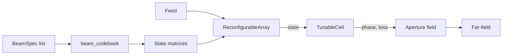
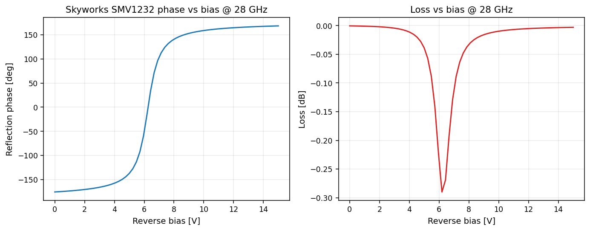
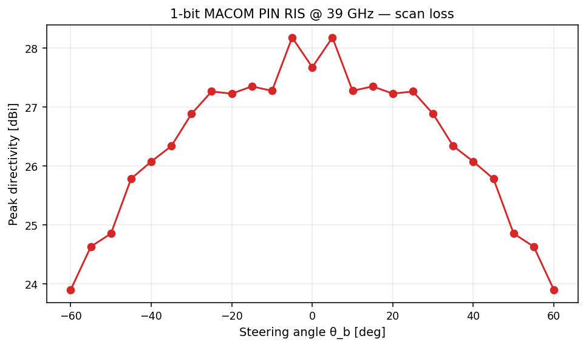

# Reconfigurable Intelligent Surfaces (RIS)

Tunable reflectarrays where each cell's phase is controlled at runtime via
varactor / PIN / liquid-crystal cells.



## Cell models

| Cell | Vendor / origin | Phase coverage | Loss | Use band |
|---|---|---|---|---|
| `Skyworks_SMV1232` | Skyworks varactor | ~ 344° at 28 GHz | < 0.3 dB | mmW (24–40 GHz) |
| `MACOM_MAVR011020` | MACOM GaAs varactor | ~ 354° at 60 GHz | < 0.2 dB | mmW (40–80 GHz) |
| `MACOM_MA4FCP305` | MACOM PIN | 180° (1-bit) | < 0.1 dB | X / Ku / mmW |
| `Skyworks_SMP1340` | Skyworks PIN | 180° (1-bit) | < 0.5 dB | Microwave |
| `Merck_GT3` | Merck LC, Fabry–Perot | > 300° at 100 GHz | ~ 0.5 dB | Sub-THz (60–300 GHz) |

## Varactor RIS — phase coverage and beam steering

| C(V) → phase / loss | Beam steering at 28 GHz |
|---|---|
|  |  |

## 1-bit PIN-diode RIS — scan loss



Sub-3 dB scan loss across ±45° on a 20×20 array, consistent with the Wu / Yang
analytical bound for 1-bit RIS quantization.

## Bias-network synthesis

`fresnelants.bias.synthesize_bias_network` lays out a Steiner-style DC tree
on the back of the array, then `write_bias_layers` emits Gerber + Excellon
ready for fab:

```python
from fresnelants.bias.network import synthesize_bias_network
from fresnelants.bias.gerber import write_bias_layers

network = synthesize_bias_network(ris, cell_current_estimate=2e-3)
write_bias_layers(network, "out_gerber/", base_name="ris_28ghz_bias")
```

Output: `*-B.Cu.gbr`, `*-B.Mask.gbr`, `*-B.Drill.drl` — sized with conservative
JLCPCB-friendly defaults (0.15 mm trace, 0.30 mm pad, 0.10 mm mask clearance).

## Coding & codebooks

`fresnelants.coding.beam_codebook` pre-computes a state-matrix per beam
direction; load with `load_codebook` from JSON for embedded controllers.

```python
from fresnelants.coding import BeamSpec, beam_codebook, save_codebook

beams = [BeamSpec(theta_deg=θ, phi_deg=φ) for θ in (0, 15, 30, 45) for φ in (0, 90, 180, 270)]
book = beam_codebook(beams, ris.cell, array_design=ris, freq=28e9)
save_codebook(book, "16beams.json")
```
