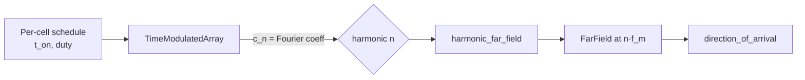

# Time-modulated arrays

Periodic 1-bit cell switching produces beams at every harmonic n·f_modulation
of the modulation frequency. Different harmonics steer to different
directions, which lets a single physical aperture serve multiple users (or
estimate direction-of-arrival from harmonic phase ratios).



## Harmonic beams (24×24 SMV1232 RIS, 28 GHz carrier)


Linear progressive switching schedule across columns. Each harmonic n carries
a distinct beam; the 0-th harmonic stays at broadside, ±1 harmonics steer
linearly with n.

## API

```python
import fresnelants as fa
from fresnelants.cells.varactor import Skyworks_SMV1232

array = fa.TimeModulatedArray(
    focal_length=0.20, design_freq=28e9, nx=24, ny=24,
    cell=Skyworks_SMV1232(), f_modulation=10e3,
)
array.linear_progressive_schedule(time_per_cell=0.5, duty=0.5)

solver = fa.HarmonicPOSolver(samples_per_wavelength=4.0, pad_factor=2)
result = solver.solve(array, freq=28e9, harmonics=[-1, 0, 1])
```

## DOA estimation

```python
from fresnelants.analysis.harmonics import harmonic_far_field, direction_of_arrival

ff_0 = harmonic_far_field(array, 28e9, 0)
ff_1 = harmonic_far_field(array, 28e9, 1)
theta, phi = direction_of_arrival(ff_0, ff_1)  # → degrees
```

Reference: Yang & Tennant, "Direction of arrival estimation using
time-modulated array antennas", *Electronics Letters* 50.13 (2014).
