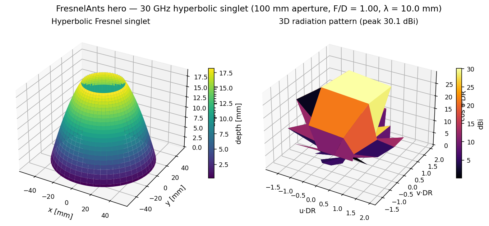
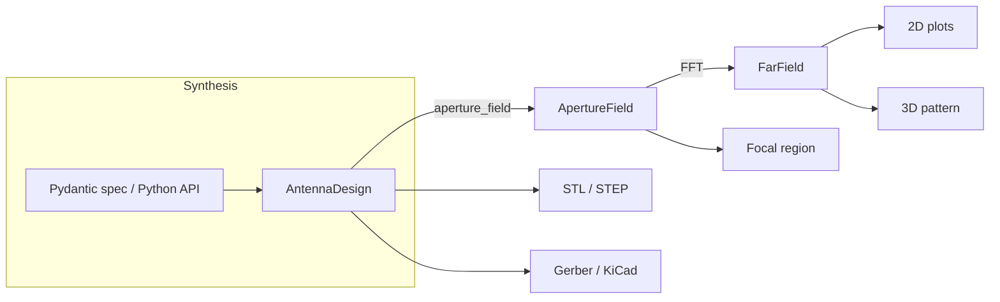

# FresnelAnts

Fresnel antenna design system covering five families:

- **Soret / Wood zone plates** — classical binary amplitude / phase-reversal plates.
- **Offset Fresnel** — off-axis feed for the broadside beam without feed blockage.
- **Phase-correcting plates** — N-level dielectric grooves approaching ideal lens efficiency.
- **Reflectarrays** — planar PCB arrays with electronic beam steering.
- **Curvilinear / constructed** — 3D hyperbolic and axicon Fresnel surfaces.





## Quickstart

```python
import fresnelants as fa

lens = fa.PhaseCorrectingPlate(
    focal_length=0.10,
    design_freq=30e9,
    aperture_radius_m=0.05,
    levels=8,
)
solver = fa.PhysicalOpticsSolver()
result = solver.solve(lens, freq=30e9)
print(f"{result.far_field.peak_directivity_dbi():.1f} dBi")
```

See [theory](theory.md) for the math, the per-design pages for parameter
references, and [solvers](solvers.md) for choosing between the built-in PO
engine and the optional Meep/NEC full-wave adapters.
