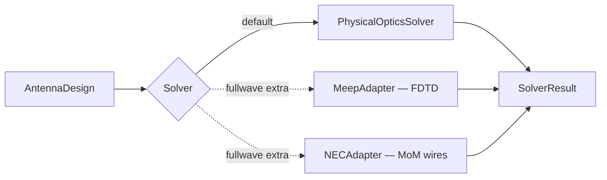

# Solvers



## Physical-optics solver (default)

`fresnelants.PhysicalOpticsSolver` synthesizes the aperture distribution and
propagates it via 2-D FFT. Suitable for primary-focus characterization of
all five Fresnel families. Fast (sub-second on most desktops at 6 samples
per wavelength up to ~30λ aperture).

```python
solver = fa.PhysicalOpticsSolver(
    samples_per_wavelength=6.0,  # raise to 8–10 for smooth sidelobes
    pad_factor=4,                # zero-pad multiplier; 8 for fine cuts
)
```

## Optional full-wave adapters (`[fullwave]` extra)

Both adapters are scaffolded with `is_available()` checks but their `solve()`
methods raise `NotImplementedError` by default — the wire-grid (NEC) and
geometry (Meep) translation is design-specific. Subclass and override:

```python
from fresnelants.solvers.meep_adapter import MeepAdapter

class WoodPlateMeep(MeepAdapter):
    def solve(self, design, freq):
        # build a Meep simulation with one geometry block per zone …
        ...
```

`pip install 'fresnelants[fullwave]'` installs `PyNEC2`. Meep itself ships
via Conda only; install via `conda install -c conda-forge pymeep`.
