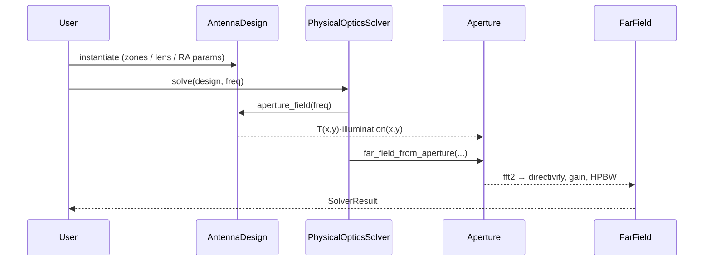

# Theory

## Fresnel zones

The classical Fresnel zone construction divides a flat aperture into annular
rings such that the optical path length from a point on the *n*-th zone
boundary to the focal point differs from the on-axis path by exactly *n* · λ/2.
Solving for the boundary radius:

$$
r_n = \sqrt{n \lambda F + \left(\frac{n\lambda}{2}\right)^2}
$$

For *n* · λ ≪ *F* this collapses to the paraxial form *rₙ ≈ √(nλF)*. The exact
form lives in [`fresnelants.core.geometry.zone_radius`][src].

[src]: https://github.com/example/fresnelants/blob/main/src/fresnelants/core/geometry.py

## Physical-optics propagation

Each design synthesizes a complex tangential E-field on a sampled flat
aperture (`ApertureField`). The far-field is its 2D Fourier transform with an
obliquity factor:

$$
E_{\text{far}}(u, v) \;\propto\; jk\cos\theta \iint E_a(x, y)\,
e^{+jk(ux + vy)}\, dx\, dy
$$

with $u = \sin\theta\cos\phi$, $v = \sin\theta\sin\phi$. We compute this via
zero-padded `numpy.fft.ifft2` (which carries the antenna-convention `+j`
sign) and apply the cosine-θ obliquity to recover the radiation field.

## Phase profile of a focusing plate

A device that converts a spherical-wave feed at $(0, 0, -F)$ into a
plane-wave output requires the phase profile

$$
\phi_{\text{plate}}(x, y) \;=\; +k\left(\sqrt{x^2 + y^2 + F^2}\, -\, F\right)
$$

The five families approximate this profile differently:

| Family | Approximation |
|---|---|
| Soret | binary amplitude (0/1) on alternating zones |
| Wood | binary phase (±1) on alternating zones |
| Phase-correcting plate | N-level quantization of the continuous profile |
| Reflectarray | unit cells with tunable reflection phase per cell |
| Curvilinear / hyperbolic | continuous dielectric thickness obeying Fermat's principle |

## Reflectarray cell phase

For a cell at $(x, y, 0)$ illuminated by a feed at $(x_f, y_f, F)$ and required
to radiate a plane wave in direction $(u, v, w)$:

$$
\phi_R(x, y) \;=\; k\sqrt{(x - x_f)^2 + (y - y_f)^2 + F^2}\, -\, k(u\, x + v\, y)\quad(\text{mod}\ 2\pi)
$$

The Gerber exporter maps this phase to a square-patch side length via a
`(phase, size)` lookup table; subclasses can replace the lookup with one
fitted to a particular substrate / unit-cell geometry.
